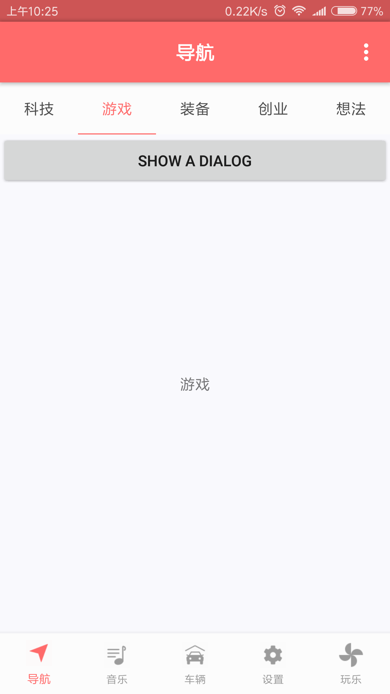
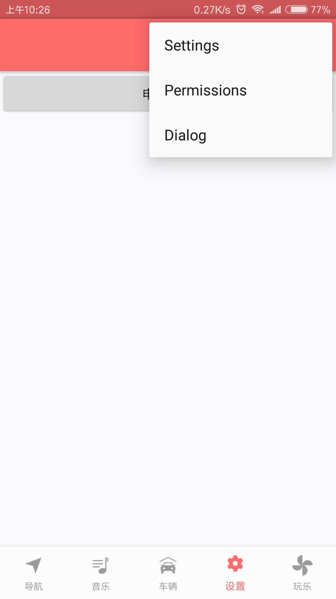

# MVC_Architecture
Android MVC架构学习Demo

这个框架是源自[itsMelo/BuzzerBeater: 迈出开源的第一步，初心为鉴，时间为证。 ](https://github.com/itsMelo/BuzzerBeater)
 ，这个架构是 “Activity+多个Fragment” 以及 “Frament内嵌多个Frgament” 为主,是
 一个很值得借鉴的框架。

 关于Fragment生命周期的讲解：[死磕 Fragment 的生命周期 - CSDN博客 ](https://blog.csdn.net/MeloDev/article/details/53406019)

### 项目截图

App体验地址:[app-debug.apk](https://github.com/simplebam/MVCArchitecture/releases/download/v1.0/app-debug.apk)

## 推荐项目
* [simplebam/Weather: 天气应用App合集 ](https://github.com/simplebam/Weather)
  * 这里的 SeeWeather 就是借鉴了这个框架，SeeWeather 也是我模仿的项目，为什么
    不推荐原作者的，而是推荐我的呢？原作者的SeeWeather存在的bug（我发现的）都已
    经修复了（原项目存在RxJava等内存泄漏问题）
* [DanteAndroid/Beauty: Just watch girls. ](https://github.com/DanteAndroid/Beauty)
  * 这项目搭建的单个Activity+多个Fragment以及单个Fragment+多个Fragment更为
    成熟,值得模仿一下.

## 推荐阅读-推荐的不仅仅是技术
* [Android开发工程师面试指南（面试题集附答案、简历模板） - 掘金 ](https://juejin.im/post/5ac1f77cf265da238155cbb7)
* [2018年android面试分享和学习总结 - CSDN博客 ](https://blog.csdn.net/qian520ao/article/details/79601179)
* [利用Android源码，轻松实现汉字转拼音功能 | 技术视界 ](http://blog.coderclock.com/2017/04/04/android/2017-04-04/)
* [android 异步通信机制Handler的分析与运用 - 掘金 ](https://juejin.im/post/58df7da2a22b9d0058660950)
* [浅谈Android的文件存储 - 掘金 ](https://juejin.im/post/5a615c796fb9a01caf377b20)
* [互联网人员简历中该有的和不该有的十点 ](http://www.trinea.cn/jobs/2018-%e4%ba%92%e8%81%94%e7%bd%91%e4%ba%ba%e5%91%98%e7%ae%80%e5%8e%86%e5%a6%82%e4%bd%95%e8%84%b1%e9%a2%96%e8%80%8c%e5%87%ba/comment-page-1/#comment-4640)
