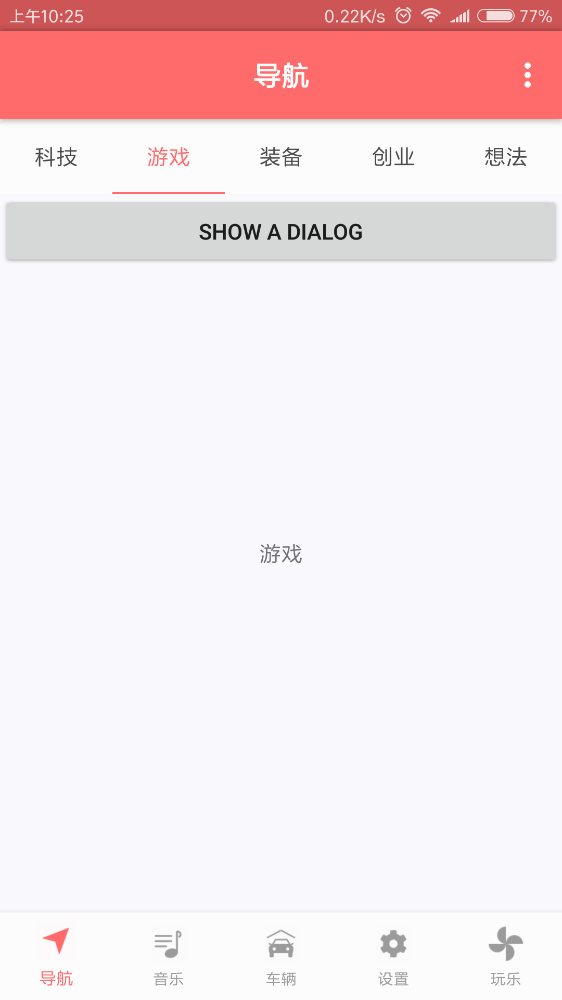
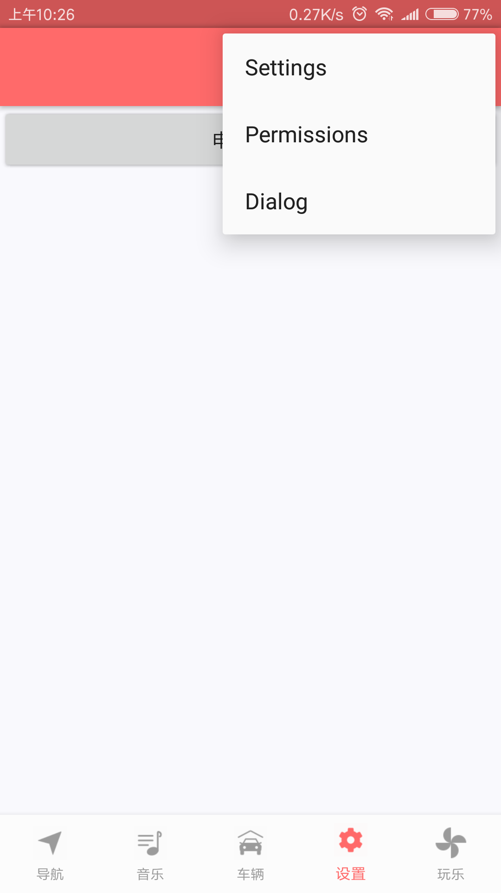

# MVC_Architecture
Android MVC架构学习Demo

这个框架是源自[itsMelo/BuzzerBeater: 迈出开源的第一步，初心为鉴，时间为证。 ](https://github.com/itsMelo/BuzzerBeater)
 ，这个架构是 “Activity+多个Fragment” 以及 “Frament内嵌多个Frgament” 为主,是
 一个很值得借鉴的框架。

 关于Fragment生命周期的讲解：[死磕 Fragment 的生命周期 - CSDN博客 ](https://blog.csdn.net/MeloDev/article/details/53406019)

### 项目截图

### 项目中用到的知识
* Android开发的框架:[死磕 Fragment 的生命周期 - MeloDev的博客 - CSDN博客](http://blog.csdn.net/MeloDev/article/details/53406019)
  别看名字是这样写的,但他写的项目框架是很好的,源码:[itsMelo/BuzzerBeater](https://github.com/itsMelo/BuzzerBeater)
  * 关于BaseActivity跟BaseFragment的封装:[从BaseActivity与BaseFragment的封
    装谈起 - Young_Kai]( http://blog.csdn.net/tyk0910/article/details/51355026)
* 权限申请：
  * [Android 6.0 运行时权限处理完全解析 - CSDN博客](https://blog.csdn.net/lmj623565791/article/details/50709663)
  * [Android6.0权限机制（三）：6.0以前国产手机权限处理 - 简书 ](https://www.jianshu.com/p/7d255fa8247d)

### 项目中用到的框架
* ahbottomnavigation
  * [aurelhubert/ahbottomnavigation: A library to reproduce the behavior of the Bottom Navigation guidelines from Material Design. ](https://github.com/aurelhubert/ahbottomnavigation)

### 开发中遇到的问题
* Android M 之后加入了运行时权限，在申请运行时权限时候,如果在 AndroidManifest
  中不加入需要申请的权限,那么也是申请不了权限的.因为检查权限时候,首先由
  PackageManager.checkPermission()检查 AndroidManifest 有没有该权限的
* 在使用 ahbottomnavigation 时候,原项目使用该开源库的版本有点低,我把它升级到
  目前最新版 bottomNavigation.setTitleState(替代了原来的
  bottomNavigation.setForceTitlesDisplay) 里面有三种状态:
  * TitleState.SHOW_WHEN_ACTIVE(默认状态):当选中时候才显示标题,不选中不显示
  * TitleState.ALWAYS_SHOW:无论选中不选中都显示标题
  * TitleState.ALWAYS_HIDE:无论选中不选中都不可以标题
